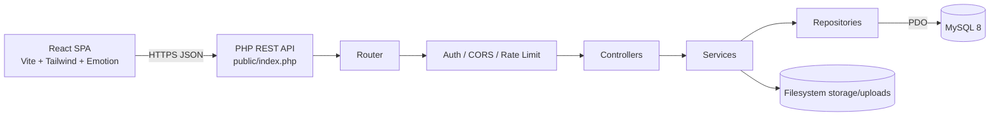
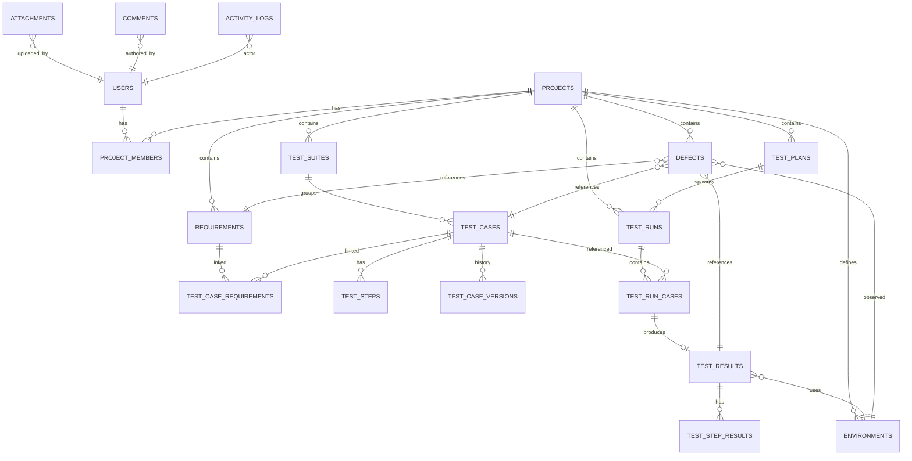

# QAFlow — System Architecture

## 1. Overall Architecture



The system is a stateless REST API with a single-page React client. State lives in MySQL and the filesystem. Authentication uses opaque bearer tokens persisted in the `auth_tokens` table with expiry.

## 2. Frontend Architecture

- Vite + React 18, JavaScript, no TypeScript.
- Routing: `react-router-dom` v6.
- Styling: Tailwind for layout and tokens; Emotion for a small set of dynamic components where Tailwind alone is awkward (DataTable cell variants, status pills).
- State: React Context for auth, toasts, and theme; local component state for page data. No global store is introduced because data is server-owned and scoped per page.
- Services layer: `src/services/*` wraps axios calls, keeps endpoints in one place, and normalizes error shapes.
- Routing guards: `ProtectedRoute` for auth; `usePermissions` hook for capability checks in UI. Server remains authoritative.
- Charts: `recharts`.
- Animation: `gsap` used sparingly for page and panel entrance only.

## 3. Backend Architecture

Layers:

- `core/` — Router, Container, AppException, Handler.
- `middleware/` — Auth, Role, CORS, RateLimit.
- `controllers/` — HTTP boundary. Parse request, call service, return JSON.
- `services/` — Business rules. Compose repository calls, enforce invariants, write activity logs.
- `repositories/` — SQL via PDO prepared statements. No business logic.
- `models/` — Lightweight entity wrappers used by services and repositories.
- `validators/` — Field-level validation with structured error output.
- `helpers/` — Response, Request, Logger, Sanitizer, Uuid.

Controllers never touch SQL. Repositories never touch HTTP. This boundary is enforced by review, not by the language.

## 4. API Architecture

Base path: `/api`.

Success response envelope:

```json
{ "data": {}, "meta": { "page": 1, "per_page": 25, "total": 132 } }
```

Error response envelope:

```json
{ "error": { "code": "VALIDATION_ERROR", "message": "Invalid input", "details": { "email": ["Required"] } } }
```

Authentication: `Authorization: Bearer <token>`.

Status codes used: 200, 201, 204, 400, 401, 403, 404, 409, 422, 429, 500.

Key endpoints (full list in `backend/routes/api.php`):

```text
POST   /api/auth/login
POST   /api/auth/logout
GET    /api/auth/me

GET    /api/projects
POST   /api/projects
GET    /api/projects/{id}
PUT    /api/projects/{id}
POST   /api/projects/{id}/archive
GET    /api/projects/{id}/members
POST   /api/projects/{id}/members

GET    /api/requirements
POST   /api/requirements
GET    /api/requirements/{id}
PUT    /api/requirements/{id}
DELETE /api/requirements/{id}
GET    /api/requirements/{id}/test-cases

GET    /api/test-suites
POST   /api/test-suites
PUT    /api/test-suites/{id}
DELETE /api/test-suites/{id}

GET    /api/test-cases
POST   /api/test-cases
GET    /api/test-cases/{id}
PUT    /api/test-cases/{id}
DELETE /api/test-cases/{id}
GET    /api/test-cases/{id}/versions

GET    /api/test-plans
POST   /api/test-plans
GET    /api/test-plans/{id}
PUT    /api/test-plans/{id}

GET    /api/test-runs
POST   /api/test-runs
GET    /api/test-runs/{id}
POST   /api/test-runs/{id}/start
POST   /api/test-runs/{id}/complete

GET    /api/executions/{id}
POST   /api/executions/{id}/steps/{stepId}/result
POST   /api/executions/{id}/result
GET    /api/executions/{id}/available

GET    /api/defects
POST   /api/defects
GET    /api/defects/{id}
PUT    /api/defects/{id}
POST   /api/defects/{id}/status

GET    /api/environments
POST   /api/environments
PUT    /api/environments/{id}
DELETE /api/environments/{id}

POST   /api/attachments
GET    /api/attachments/{id}
DELETE /api/attachments/{id}

GET    /api/comments
POST   /api/comments

GET    /api/dashboard/summary
GET    /api/dashboard/charts

GET    /api/reports/execution
GET    /api/reports/defects
GET    /api/reports/coverage
GET    /api/reports/project-summary

GET    /api/traceability/matrix

GET    /api/activity

POST   /api/automation/ingest
```

## 5. Database Architecture

Normalized MySQL schema. Authoritative DDL lives in `database/schema.sql`.



Design decisions:

- Test cases are defined once. Test runs reference them via `test_run_cases` and store execution-specific state in `test_results`.
- Test steps are rows, not a single text field.
- Version history: on update of a test case, a full snapshot (fields + steps JSON) is inserted into `test_case_versions`.
- Requirement ↔ Test Case is many-to-many via `test_case_requirements`.
- Severity and priority are distinct columns on `defects`.
- Attachments and comments use polymorphic (`entity_type`, `entity_id`) references with an index for lookup.

## 6. Authentication

- Login: POST email + password. Server loads user, verifies with `password_verify`, issues an opaque 64-char hex token with 24h expiry stored in `auth_tokens`.
- Requests: `Authorization: Bearer <token>`. Middleware loads token row, checks expiry, loads user, attaches to request context.
- Logout: deletes the token row.
- No JWT. Opaque tokens are simpler to revoke and adequate for an internal tool.

## 7. Authorization

- Roles are stored per user globally and per project via `project_members.role`.
- `RoleMiddleware` checks a route-declared role list against the union of the user's global role and project role when `project_id` is present in the request.
- Services perform ownership checks where needed (for example, a QA Engineer can execute a test only if assigned or a project member).
- The frontend hides disallowed UI, but the backend is authoritative.

## 8. File Storage

- Uploads go to `backend/storage/uploads/{yyyy}/{mm}/`.
- Filenames are regenerated: `{uuid}.{ext}`. The original filename is preserved only as metadata.
- Allowed MIME: `image/png`, `image/jpeg`, `image/webp`, `application/pdf`, `text/plain`, `text/csv`, `application/zip`.
- Max size: 10 MB per file.
- MIME is verified with `finfo_file`, not by extension.

## 9. Error Handling

- Backend: all exceptions funnel through `Handler` which maps `AppException` subclasses to HTTP codes and returns the standard error envelope. Unexpected exceptions log to `storage/logs/app.log` and return a generic 500 without a stack trace.
- Frontend: axios interceptor normalizes errors; pages render `ErrorState` with retry, and 401 triggers a global logout.

## 10. Validation

- Backend: `validators/*` implement field-level rules; services call them before persistence. Validation errors return 422 with `details`.
- Frontend: `utils/validators.js` mirrors critical rules for UX. Backend remains authoritative.

## 11. Security

- `password_hash` / `password_verify` with bcrypt.
- All SQL is prepared statements via PDO with `ATTR_EMULATE_PREPARES = false`.
- Input trimmed and typed; output JSON-encoded (no HTML rendering of stored content).
- CORS limited to configured origin from `.env`.
- Rate limiting on `/api/auth/login` (10/min per IP) using a DB-backed counter in `login_attempts`.
- Uploads validated by MIME and size; stored outside the web root; served through a controller that checks authorization.
- `.env` holds DB credentials, CORS origin, upload path, log path. `.env.example` provides the shape.

## 12. Reporting

All report queries are aggregated in `ReportService` using SQL on `test_results`, `defects`, and `test_case_requirements`. Reports are returned as JSON. CSV export is generated client-side from the same JSON to avoid a duplicate server-side CSV pipeline.

## 13. Traceability Model

For a project, the traceability matrix joins:

- `requirements` left join `test_case_requirements` left join `test_cases`.
- `test_results` filtered to the project's runs.
- `defects` filtered to the project.

Per requirement:

- `test_case_count` = distinct test cases linked.
- `executed` = distinct test cases with a `test_results` row.
- `passed` / `failed` / `blocked` = distinct test cases whose latest result equals that status.
- `defects` = distinct defects referencing the requirement.
- `coverage` = `test_case_count > 0 ? 100 : 0` at requirement level; project coverage = `covered_requirements / total_requirements * 100`.

Execution coverage and pass rate are separate metrics:

- Execution Coverage = `executed_cases / total_cases_in_runs * 100`.
- Pass Rate = `passed / (passed + failed + blocked) * 100` over executed cases.

These are documented explicitly so no UI mixes them.

## 14. Test Execution Model

- A `test_run` has many `test_run_cases` (one per test case included).
- Each `test_run_case` produces at most one `test_result`.
- Each `test_result` has many `test_step_results`, one per step of the referenced test case.
- Step results store `status`, `actual_result`, `notes`.
- Overall result is computed on the backend from step results unless overridden by an explicit `POST /result` call. Overrides are recorded.

## 15. Version History

On `PUT /test-cases/{id}`:

1. Load current row + steps.
2. Serialize to `{ fields, steps }` snapshot.
3. Insert into `test_case_versions` with incremented `version_no`.
4. Apply update.
5. Return new entity.

Snapshots are immutable. A version's `changed_fields` column lists field names changed relative to the previous version.

## 16. Automation API Strategy

`POST /api/automation/ingest` accepts:

```json
{
  "project_id": 1,
  "test_run_id": 12,
  "source": "playwright",
  "results": [
    { "test_case_id": 34, "status": "pass", "duration_ms": 1200, "steps": [{"order":1,"status":"pass"}] }
  ]
}
```

The endpoint requires an API token (stored in `api_tokens`) scoped to a project. Ingestion maps external test cases to QAFlow test cases via the `external_id` column on `test_cases`. Results are written as `test_results` entries with `is_automated = 1`.

## 17. AI Extension Strategy

`AiSuggestionService` exposes `suggestTestCases(string $requirementText): array`. The default implementation returns a deterministic template-based skeleton so the application works offline. A future provider (OpenAI, Azure, local model) can be wired by swapping the implementation bound in `Container`. The service is not called from the MVP UI unless enabled via a config flag.

## 18. Deployment

- Backend: Apache or nginx pointing at `backend/public/`. Rewrite all non-file requests to `index.php`.
- Frontend: `npm run build` produces `dist/`. Served statically by nginx or Apache. In dev, Vite dev server proxies `/api` to PHP.
- MySQL 8 on the same host or a managed instance.
- Recommended: two virtual hosts — `qaflow.example.com` (frontend) and `qaflow.example.com/api` (backend) or the same host with path-based routing.

## 19. Environment Configuration

Backend `.env`:

```text
APP_ENV=production
APP_DEBUG=false
DB_HOST=127.0.0.1
DB_PORT=3306
DB_NAME=qaflow
DB_USER=qaflow
DB_PASS=change-me
CORS_ORIGIN=https://qaflow.example.com
UPLOAD_DIR=storage/uploads
LOG_DIR=storage/logs
TOKEN_TTL_HOURS=24
RATE_LIMIT_PER_MIN=60
AI_ENABLED=false
```

Frontend `.env`:

```text
VITE_API_BASE_URL=/api
```

## 20. Scalability Considerations

- All list endpoints paginated with `LIMIT/OFFSET`.
- Indexes on every foreign key and on frequent filter columns (`status`, `priority`, `project_id`).
- Aggregations in dashboards run per project, not globally.
- The API is stateless; horizontal scale is possible behind a load balancer with shared MySQL and shared storage.
- Future: move uploads to object storage; introduce caching for dashboard aggregates.

## 21. Technical Decisions

- Opaque tokens over JWT: revocable and simpler for an internal tool.
- PHP over Node for the backend: matches the requested stack and the internal enterprise audience; PHP-FPM is operationally familiar.
- No Redux: server state is fetched per page; Context is sufficient.
- No gradient design: enforced in `design.md`; the token system has no gradient utilities.
- CSV export client-side: keeps the API surface smaller and lets users see exactly what will be downloaded.